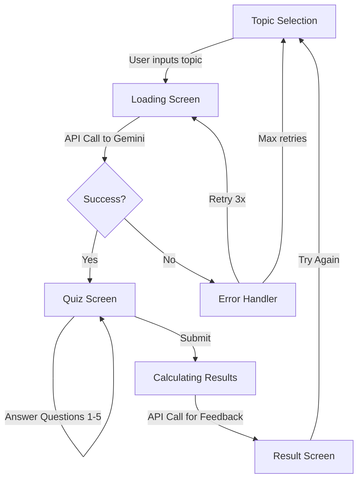

# AI-Assisted Knowledge Quiz 🚀

A stunning, AI-powered quiz application featuring a modern **liquid-glass (glassmorphism)** aesthetic. Built with React, TypeScript, TailwindCSS, and Google Gemini AI to generate custom questions on any topic you can imagine.


## ✨ Features

- 🤖 **AI-Powered Question Generation** - Google Gemini creates 5 unique MCQs on any topic
- 🎨 **Liquid-Glass UI Design** - Stunning glassmorphism aesthetic with cyber-glow effects
- 🌈 **Premium Visual Experience** - Gradient backgrounds, neon accents, and smooth animations
- 🔄 **Interactive Animations** - GSAP-powered transitions for enhanced user experience
- 💡 **Smart AI Feedback** - Personalized, witty feedback based on quiz performance
- 📱 **Fully Responsive** - Beautiful on desktop, tablet, and mobile devices
- 🌓 **Dark/Light Mode** - Toggle themes for comfortable viewing (currently optimized for dark mode)

## 🎬 Demo


## 🚀 Quick Start

### Prerequisites
- Node.js (v18 or higher)
- Google Gemini API Key ([Get one free](https://makersuite.google.com/app/apikey))

### Installation

```bash
# Clone the repository
git clone <your-repo-url>
cd ai-assisted-knowledge-quiz

# Install dependencies
npm install

# Create .env file
echo VITE_GEMINI_API_KEY=your_api_key_here > .env

# Start development server
npm run dev
```

The app will be available at `http://localhost:5173/`

### Getting a Gemini API Key
1. Visit [Google AI Studio](https://makersuite.google.com/app/apikey)
2. Sign in with your Google account
3. Click "Create API Key"
4. Copy and paste it into your `.env` file

## 🤖 AI Prompts & Refinements

### Challenge: Consistent JSON Output
Getting AI to return **structured, parseable JSON** was the biggest challenge. Initial attempts resulted in:
- Markdown-wrapped JSON (````json ... ````)
- Inconsistent object structures
- Random text before/after JSON
- Nested arrays instead of flat arrays

### Initial Prompt (❌ Failed)
```
Generate 5 multiple-choice questions about "{topic}". 
Return as JSON array.
```

**Problems:**
- Too vague, Gemini added markdown formatting
- Inconsistent schema (sometimes nested objects)
- Extra explanatory text mixed with JSON

### Refined Prompt (✅ Success)
```
Generate 5 multiple-choice questions about "{topic}". 
Return the response ONLY as a valid JSON array of objects. 
Each object should have:
- "id": number (1-5)
- "text": string (the question)
- "options": array of 4 strings
- "correctAnswer": string (must be one of the options)

Do not include markdown formatting like ```json. 
Just the raw JSON array. No additional text.
```

**Key Improvements:**
✅ Explicit "ONLY" and "raw JSON" instructions  
✅ Clear schema with data types  
✅ Explicit markdown exclusion  
✅ Numbered requirements for clarity  

### Feedback Generation Prompt
```
A user just took a quiz on "{topic}" and scored {score}/5. 
Write a short, encouraging, and witty feedback message for them (max 2 sentences).
```

**Why it works:**
- Simple, focused task
- Constrained output length (max 2 sentences)
- Personality injection ("witty") makes responses engaging
- No complex JSON parsing needed

### Additional Refinements Made
1. **JSON Cleanup Function** - Strips markdown artifacts and extra text
2. **Retry Logic** - 3 attempts with exponential backoff for failed API calls
3. **Validation** - Ensures all questions have exactly 4 options and a valid correct answer
4. **Error Boundaries** - Graceful fallbacks for malformed responses

## 🏗️ Architecture & State Management

### Technology Stack

| Layer | Technology | Why? |
|-------|-----------|------|
| **Frontend** | React 19 + TypeScript | Type safety, modern hooks, performance |
| **Styling** | TailwindCSS 3.4 | Utility-first, glassmorphism utilities |
| **Animation** | GSAP 3.13 | Professional-grade animations |
| **AI** | Google Gemini AI | Advanced LLM for question generation |
| **Build Tool** | Vite 7 | Lightning-fast HMR and builds |
| **Icons** | Lucide React | Beautiful, consistent icon set |

### Project Structure

```
src/
├── services/
│   └── aiService.ts          # 🤖 Gemini API integration & error handling
├── context/
│   └── QuizContext.tsx       # 🎯 Global state management (Context API)
├── components/
│   └── Layout.tsx            # 🎨 Main layout with theme toggle
├── screens/
│   ├── TopicSelection.tsx    # 📝 Screen 1: Topic input
│   ├── LoadingScreen.tsx     # ⏳ Screen 2: Loading state
│   ├── QuizScreen.tsx        # ❓ Screen 3: Quiz questions
│   └── ResultScreen.tsx      # 🏆 Screen 4: Results & feedback
├── App.tsx                   # 🚪 Main app component & routing
├── index.css                 # 🎨 Global styles & glassmorphism utilities
└── main.tsx                  # ⚡ App entry point
```

### State Management: React Context API

**Why Context API over Redux/Zustand?**
- ✅ Simple, linear quiz flow (no complex state interactions)
- ✅ Small state surface (topic, questions, score, current screen)
- ✅ No need for middleware or devtools
- ✅ Built-in React feature (no external dependencies)

**State Structure:**
```typescript
interface QuizState {
  topic: string
  questions: Question[]
  currentQuestionIndex: number
  userAnswers: string[]
  score: number
  feedback: string
  currentScreen: 'topic' | 'loading' | 'quiz' | 'result'
  isDarkMode: boolean
  isCalculatingResult: boolean
}
```

### Application Flow



### Key Architecture Decisions

#### 1. **aiService.ts** - Centralized AI Logic
- **Single Responsibility**: All Gemini interactions in one place
- **Error Handling**: Try-catch with retry logic
- **JSON Cleanup**: Regex-based sanitization for malformed responses
- **Type Safety**: Strict Question interface validation

```typescript
export interface Question {
  id: number
  text: string
  options: string[]
  correctAnswer: string
}
```

#### 2. **QuizContext.tsx** - Unidirectional Data Flow
- **Actions**: `startQuiz()`, `selectAnswer()`, `submitQuiz()`, `restartQuiz()`
- **Derived State**: Progress calculated from `currentQuestionIndex` and `questions.length`
- **Side Effects**: API calls wrapped in async actions with loading states

#### 3. **Screen Components** - Separation of Concerns
Each screen is **isolated** and **stateless**:
- Receives props from Context
- No direct API calls (delegated to Context)
- Focused on UI rendering and user interactions

## 🎨 Design System: Liquid-Glass Aesthetic

### Design Philosophy
Inspired by **Apple's glass UI** and **cyber-glow aesthetics**, the design creates a futuristic, premium feel through:
- **Glassmorphism**: Frosted glass effect with backdrop blur
- **Neon Accents**: Cyan, purple, and electric blue highlights
- **Glowing Shadows**: Soft radial glows and shadow effects
- **Smooth Animations**: Hover states, scale transforms, and floating effects

### Color Palette

```css
/* Background Gradient */
background: radial-gradient(circle at top left, #1a1a40, transparent 60%),
            radial-gradient(circle at bottom right, #2d1b4e, transparent 60%),
            linear-gradient(to bottom right, #050510, #0f0f2d, #050510);

/* Glass Effect */
background: rgba(255, 255, 255, 0.1);
backdrop-filter: blur(40px);
border: 1px solid rgba(255, 255, 255, 0.2);

/* Neon Accents */
--neon-cyan: #06b6d4;
--neon-purple: #a855f7;
--neon-blue: #3b82f6;
```

### Glassmorphism Components

#### **Glass Panel** (Cards, Question Box)
```css
.glass-panel {
  background: rgba(255, 255, 255, 0.1);
  backdrop-filter: blur(40px);
  border: 1px solid rgba(255, 255, 255, 0.2);
  border-radius: 24px;
  box-shadow: 0 0 40px rgba(0, 0, 0, 0.3);
  transition: all 0.3s ease;
}

.glass-panel:hover {
  transform: scale(1.02);
  box-shadow: 0 0 60px rgba(0, 0, 0, 0.4);
}
```

#### **Glass Button** (Interactive Elements)
```css
.glass-btn {
  background: rgba(255, 255, 255, 0.1);
  backdrop-filter: blur(20px);
  border: 1px solid rgba(255, 255, 255, 0.2);
  border-radius: 16px;
  box-shadow: 0 0 20px rgba(0, 0, 0, 0.2);
}

.glass-btn:hover {
  transform: scale(1.05);
  background: rgba(255, 255, 255, 0.2);
  box-shadow: 0 0 30px rgba(0, 255, 255, 0.3);
  border-color: rgba(255, 255, 255, 0.4);
}
```

#### **Neon Text Effects**
```css
.text-neon-cyan {
  color: #06b6d4;
  text-shadow: 0 0 10px rgba(34, 211, 238, 0.5);
}
```

### Typography
- **Font**: Inter (Google Fonts) - Modern, clean, highly readable
- **Headings**: Bold (700), tight tracking
- **Body**: Medium (500), comfortable line-height

### Responsive Design
- **Mobile** (<640px): Single column, larger touch targets
- **Tablet** (640px-1024px): Optimized spacing
- **Desktop** (>1024px): Max-width container for readability

## 🎬 GSAP Animations

### Stagger Animations (Topic Selection)
```javascript
gsap.from('.stagger-anim', {
  y: 40,
  opacity: 0,
  duration: 0.9,
  stagger: 0.12,
  ease: 'power3.out'
});
```

### Slide-In Transitions (Quiz Questions)
```javascript
gsap.fromTo('.question-anim',
  { opacity: 0, x: 60, scale: 0.95 },
  { opacity: 1, x: 0, scale: 1, duration: 0.6, stagger: 0.1, ease: 'back.out(1.4)' }
);
```

### Bounce Effect (Result Screen)
```javascript
gsap.from('.result-anim', {
  y: 40,
  opacity: 0,
  duration: 0.9,
  stagger: 0.15,
  ease: 'back.out(1.7)'
});
```

## ⚠️ Known Issues & Limitations

### Current Issues
1. **API Rate Limits** - Gemini free tier has rate limits; rapid retries may fail
2. **No Question Review** - Users can't review correct/incorrect answers after quiz
3. **No Offline Support** - Requires internet connection for all features
4. **No Question History** - Previous quizzes are not saved
5. **Light Mode Optimization** - Current design is optimized for dark mode; light mode needs refinement
6. **Accessibility** - Focus states and screen reader support could be improved

### Potential Improvements

#### 🎯 Feature Enhancements
- [ ] **Difficulty Levels** - Easy, Medium, Hard question generation
- [ ] **Timer Mode** - Timed quizzes with countdown
- [ ] **Question Review** - Show correct answers and explanations after quiz
- [ ] **Quiz History** - Save and review past quiz results (LocalStorage/IndexedDB)
- [ ] **Multiplayer Mode** - Real-time competitive quizzes
- [ ] **Leaderboard** - Global/topic-based leaderboards
- [ ] **Export Results** - Download results as PDF or share on social media
- [ ] **Custom Quiz Length** - Let users choose number of questions (5, 10, 15, 20)

#### 🎨 UI/UX Improvements
- [ ] **Light Mode Polish** - Refine glassmorphism for light theme
- [ ] **Skip Question** - Allow users to skip and return to questions
- [ ] **Progress Persistence** - Save quiz progress in case of accidental refresh
- [ ] **Sound Effects** - Subtle audio feedback for interactions
- [ ] **Confetti Animation** - Celebration effect for perfect scores
- [ ] **Mobile Gestures** - Swipe gestures for question navigation

#### 🔧 Technical Enhancements
- [ ] **Server-Side Proxy** - Hide API key from client (security)
- [ ] **Caching Layer** - Cache common topics to reduce API calls
- [ ] **Error Boundaries** - More robust error handling UI
- [ ] **Unit Tests** - Jest + React Testing Library coverage
- [ ] **E2E Tests** - Playwright/Cypress for critical user flows
- [ ] **Analytics** - Track popular topics and user engagement
- [ ] **i18n Support** - Multi-language interface

#### ♿ Accessibility
- [ ] **Keyboard Navigation** - Full keyboard support
- [ ] **Screen Reader** - ARIA labels and semantic HTML
- [ ] **Focus Indicators** - Clear focus states for interactive elements
- [ ] **Color Contrast** - WCAG AA compliance

## 🔒 Security Considerations

### Current Implementation
- ✅ API key stored in `.env` (not committed to git)
- ✅ Input sanitization for topic strings
- ⚠️ **Warning**: API key exposed in client-side code (inspect network requests)

### Production Recommendations
1. **Server-Side Proxy** - Move API calls to backend to hide API key
2. **Rate Limiting** - Implement request throttling
3. **Input Validation** - Server-side validation for user inputs
4. **CORS Configuration** - Restrict API access to your domain

## 📦 Build & Deploy

### Production Build
```bash
npm run build
```

### Preview Build Locally
```bash
npm run preview
```

### Deployment
Deploy the `dist/` folder to any static hosting:
- **Vercel** (Recommended) - Zero config, automatic deployments
- **Netlify** - Easy drag-and-drop deployment
- **GitHub Pages** - Free hosting for public repos
- **Cloudflare Pages** - Fast global CDN

**⚠️ Important**: Set `VITE_GEMINI_API_KEY` in your hosting platform's environment variables!

### Vercel Deployment
```bash
# Install Vercel CLI
npm i -g vercel

# Deploy
vercel

# Set environment variable
vercel env add VITE_GEMINI_API_KEY
```

## 🧪 Testing

### Manual Testing Checklist
- [ ] Topic selection with custom input
- [ ] Topic selection with suggested topics
- [ ] All 5 questions load correctly
- [ ] Answer selection works
- [ ] Navigation buttons (Previous/Next) work
- [ ] Submit button triggers result screen
- [ ] Score calculation is accurate
- [ ] AI feedback is relevant and encouraging
- [ ] "Try Again" button restarts quiz
- [ ] Theme toggle works
- [ ] Responsive design on mobile/tablet/desktop
- [ ] Loading states display correctly
- [ ] Error handling for failed API calls

### Edge Cases to Test
- Very long topic names (e.g., "The History of 18th Century European Baroque Music")
- Special characters in topics (e.g., "C++ Programming")
- Emoji in topics (e.g., "🍕 Pizza History")
- API rate limit exceeded
- Network offline during quiz
- Browser refresh mid-quiz

## 🤝 Contributing

Contributions are welcome! Some areas that need help:
1. Light mode color refinement
2. Accessibility improvements
3. Unit and E2E test coverage
4. Backend proxy implementation
5. Additional animation polish

## 📄 License

MIT License - feel free to use this project for learning or commercial purposes.

---

## 📚 Learning Resources

This project demonstrates:
- **React Context API** for state management
- **TypeScript** for type safety
- **TailwindCSS** for utility-first styling
- **GSAP** for professional animations
- **Google Gemini AI** integration
- **Prompt Engineering** for consistent AI outputs
- **Error Handling** and retry logic for APIs
- **Glassmorphism** design patterns

---

**Built with ❤️ using AI-assisted development and modern web technologies**

**Questions or feedback?** Open an issue or submit a pull request!
